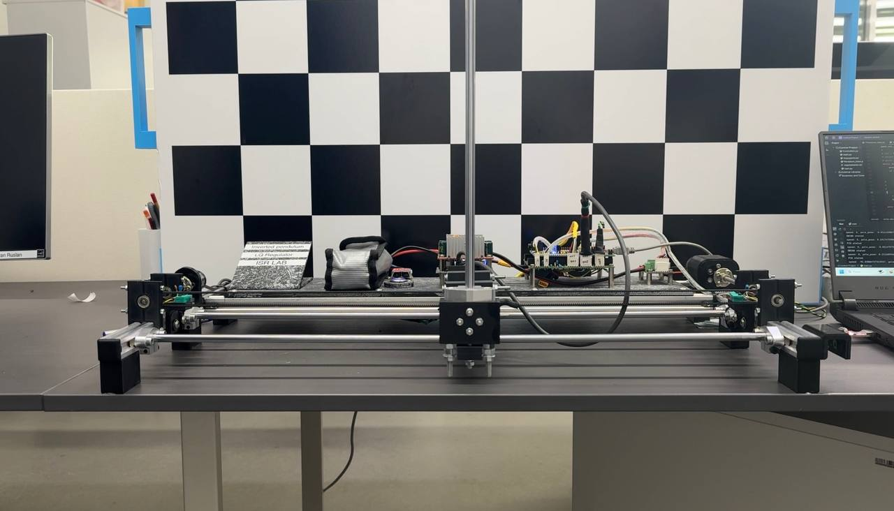

# Energy based controller for real inverted pendulum stand

## Overview
The "Energy based controller for real inverted pendulum stand" project is aimed to test traditional cart-pole system control method such as PD control and Energy based control in real life.

- Course: Advanced Control Methods, Skoltech, 2024
- Team Members: Sergey Bakulin, Ruslan Babakyan, Artem Bazhenov
- Final Presentation: https://docs.google.com/presentation/d/1UkfdIFDTp4hr2HpFwEp8onsQ0ok_Wjc1/edit?usp=sharing&ouid=100422232997772233481&rtpof=true&sd=true

---

## Table of Contents

- [Overview](#overview)
- [Problem Statement](#problem-statement)
- [Results](#results)
- [Run the Project](#run-the-project)
- [Other Section](#other-section)
- [Bibliography](#bibliography)

---

## Problem Statement
The project includes such key objectives as:
- Developing the low-level software for the for the real inverted pendulum stand (RIPS)
- Holding the pendulum in an vertical position for RIPS
- Making the pendulum swing
- Solvng the problems of limiting the linear motion of the pendulum

---

## Results
The outcomes of the project are:
- The Inverse Pendulum Stand was built
- The Low level software for the Stand was developed
- The High level communication was created
- PD controller for the pendulum angular position was developed and Energy-based controller were implemented

Despite the fact, that "in metal" implementation of the cart-pole system is pretty challenging task, we were able to deal with most of the problems on our winding way and, as a result, got a full working real-life model with a fine tuned controllers in it.



However, the project is opened for the future work, such as making the cart position control and implementating the MPC, requiring some changes to stand hardware.

---

## Run the Project
- Clone this repository
- Open Cube IDE projecte from "STM32 software" folder
- Upload firmware to the STM32 from Cube IDE
- Connect USB-UART converter to the PC

### Requirements
 - Python 3
 - Numpy
 - PySerial

### Setup and Installation
The project setup includes following steps:
- Installing dependencies: `pip install -r requirements.txt`
- Setting up a virtual environment
- Connect USB-UART converter to the PC
- Define the number of the COM port in the system

### Running the Code
To start the project, you need to run following command:
```bash
python main.py <COM PORT>
```

---

## Bibliography

- Tran, Ashley & Pepitone, Paola & Choi, Jun. (2019). State Space and Energy Based Control for an Autonomous Self-Rising Inverted Pendulum. 10.13140/RG.2.2.36425.70243. 